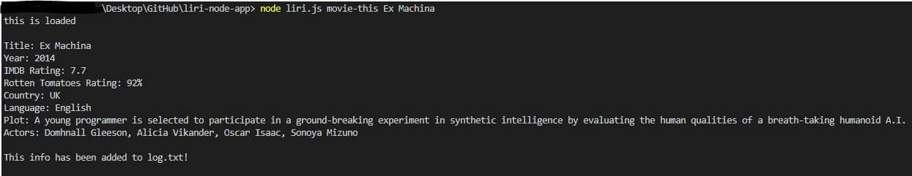

# liri-node-app

## Function Calls

## Bands in Town Code

## Bands in Town Demo

## Spotify Code

## Spotify Demo

## OMDB Code

## OMDB Demo

## do-what-it-says Code

## do-what-it-says Demo

## Writing to log.txt
